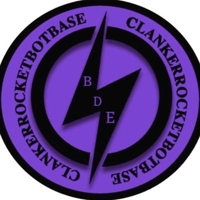

# BDE Token Website

## Overview
Official website for BDE Token on Base Network. The website provides real-time price tracking, trading functionality, and detailed tokenomics information.

## Features
- Real-time price updates
- Live TradingView chart integration
- Direct Uniswap trading integration
- Token statistics and metrics
- Mobile-responsive design
- Social media integration
- Contract verification links

## Tech Stack
- React.js
- Vite
- TradingView Widget
- DexScreener API
- Tailwind CSS
- SweetAlert2
- Heroicons

## Quick Start

### Prerequisites
- Node.js (v14 or higher)
- npm or yarn

### Installation
1. Clone the repository
